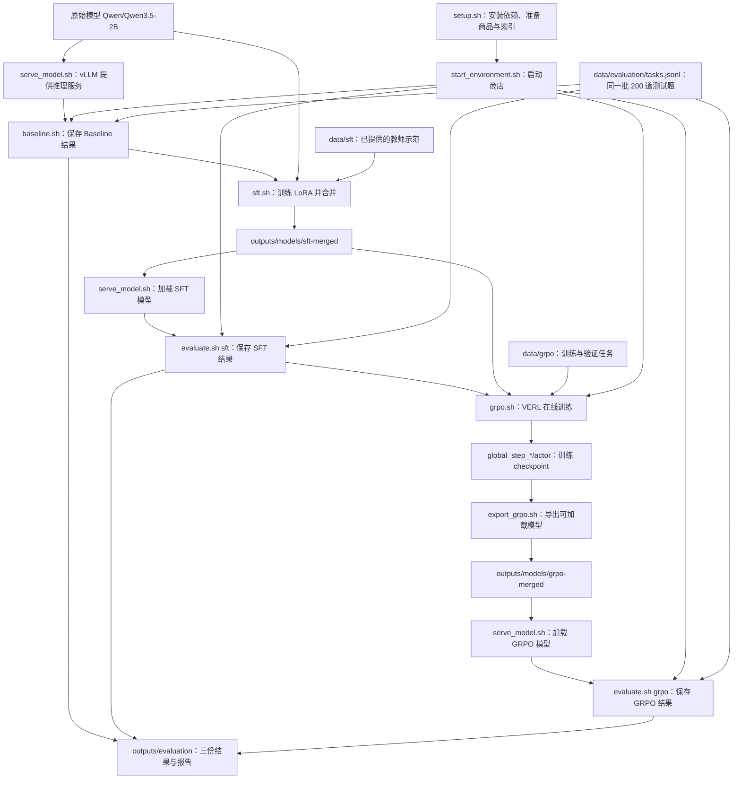

# shopping-grpo-longhorizon：项目结构与完整复现指南

这份文档从“我先把实验跑一遍，再知道代码在哪里”出发。先认识项目的整体结构，然后按终端和执行顺序复现 **Baseline、SFT、GRPO 三个主实验**；数据采集、课程训练和参数对照放在后面。

本文以当前 [README](../README.md)、实际脚本和配置为依据。已按要求忽略 `prepare_readme_baseline.sh` 和 `setup_shared_env.sh`。本文只说明操作，没有执行训练、模型合并或正式评测。

阅读顺序：[项目总览](#overview) → [主实验完整复现](#reproduction) → [按阶段找代码](#reading)；扩展实验和完整文件索引按需要查阅。

<a id="overview"></a>

## 1. 先认识整个项目

### 1.1 项目究竟在做什么

项目让一个语言模型在模拟商城里完成购物：接收需求，搜索商品，打开详情，选择规格，最后购买。模型发出工具调用，商店执行动作并返回页面信息。

全部阶段固定使用 ShopSimulator Environment v2.1、Reward v3、observation v2 和 tool schema v2。理解它们的具体实现可以放在主流程跑通之后。

项目想比较的是：**同一个基础模型，在没有训练、完成 SFT、继续完成 GRPO 之后，购物能力有什么变化？**

因此，仓库的主线只有一条：

```text
Baseline → SFT → GRPO → Evaluation
```

落实成操作，实际顺序是：

```text
准备依赖、商品数据和搜索索引
    ↓
启动 ShopSimulator，后续保持运行
    ↓
原始 Qwen 模型 → 跑 Baseline 评测 → 保存第一份结果
    ↓
原始 Qwen 模型 + 已提供的示范数据 → SFT 训练 → 合并 SFT 模型
    ↓
SFT 模型 → 跑 SFT 评测 → 保存第二份结果
    ↓
SFT 模型 + 商店里的在线交互 → VERL GRPO 训练 → 导出 GRPO 模型
    ↓
GRPO 模型 → 跑 GRPO 评测 → 保存第三份结果
    ↓
比较三份结果
```

**Baseline 是第一次评测，不是一次训练。** SFT 和 GRPO 是两次连续训练；Evaluation 是统一比较方法，所以会在原始模型、SFT 模型和 GRPO 模型上分别执行。

### 1.2 完整逻辑流程图



图中的 `serve_model.sh` 负责“把模型开起来”，`evaluate.sh` 负责“让已经开起来的模型做题”。这两个动作分别在不同终端执行。

### 1.3 仓库目录如何对应这条流程

```text
仓库根目录/
├── README.md                    项目介绍与主流程命令
├── pyproject.toml、uv.lock       需要安装哪些 Python 包、固定哪些版本
├── scripts/                     你实际运行的命令入口
├── configs/                     GRPO、工具、AgentLoop 与对照实验配置
├── data/
│   ├── sft/                     SFT 的示范轨迹：800 训练 / 200 验证
│   ├── grpo/                    GRPO 的任务：1000 训练 / 50 验证
│   ├── evaluation/              统一测试题：Final-200 Clean
│   ├── sft_pure_v4/             课程训练使用的额外示范数据
│   └── sft_curriculum/          课程训练的划分与阶段清单
├── environments/ShopSimulator/  商店本身：商品、搜索、页面、动作与奖励
├── src/shopping_grpo/            本项目实现：连接商店、组织交互、对接训练和评测
├── experiments/                 已提交的实验配置与结果摘要
├── docs/                        各模块的进一步说明
├── patches/                     针对固定 VERL 版本的补丁
├── tests/                       检查代码行为的测试
└── outputs/                     运行后生成的权重、轨迹、日志和报告
```

先记住四个关系，就能定位大部分问题：

- **`scripts/` 是入口，`src/shopping_grpo/` 是实现。** 例如运行 `grpo.sh`，最终会用到项目的 GRPO 适配代码和安装好的 VERL。
- **`configs/` 决定怎么跑，`data/` 决定用什么数据跑。**
- **`environments/ShopSimulator/` 是商店，`src/shopping_grpo/environment/` 是模型连接商店的一侧。**
- **`experiments/` 是仓库已有的结果摘要，`outputs/` 是你自己本次运行的产物。** 运行脚本不会自动更新 `experiments/`。

### 1.4 VERL、vLLM 分别在哪里工作

| 组件 | 在本项目中的职责 | 你第一次接触它的位置 |
|---|---|---|
| ShopSimulator | 执行搜索、查看、选规格、购买，返回页面和奖励 | `start_environment.sh` |
| vLLM | 加载模型，接收输入，生成下一步动作 | `serve_model.sh`；GRPO 内部也使用它生成轨迹 |
| Transformers / PEFT | 用已有示范训练 SFT LoRA，随后合并模型 | `sft.sh` → `train_lora_sft.py` |
| VERL | 组织 GRPO 的在线交互、奖励处理和模型更新 | `grpo.sh` → `train_grpo.py` → `verl.trainer.main_ppo` |

**本仓库没有把 VERL 和 vLLM 的完整源码复制进来。** 它们由安装脚本装入主虚拟环境。`src/shopping_grpo/training/grpo/` 保存的是本项目连接 VERL 与购物环境的代码。

## 2. 先明确“完整复现”的范围

第一次应当完成的是：**使用仓库已经提供的数据，训练 SFT 和 GRPO，并得到原始模型、SFT 模型、GRPO 模型在当前 Final-200 Clean 上的三份评测结果。** 下节给出完整顺序。

这与“重新生成作者所有历史数字”有区别：

| 内容 | 如何处理 |
|---|---|
| README 的主流程：Baseline / SFT / GRPO | 按第 3 节完整执行 |
| README 的教师数据采集命令 | 数据已经提供，首次主流程可直接使用；想重做采集时看第 6.1 节 |
| 课程 SFT | 替换主流程的 SFT 阶段，看第 6.2 节 |
| 注册表中的 4 个 SFT、6 个 GRPO 设置 | 按第 6.3 节逐项执行对照实验 |
| README 的 Flash / Pro 双 Judge 评估设计 | 当前默认评测入口没有串接完整流程，见第 7.3 节 |
| README 的历史成绩及其他模型评测 | 原始权重、完整日志、部分启动协议没有全部提交，见第 7.4 节 |

当前主流程使用的是 **Final-200 Clean**。README 中 `0.0% / 60.5% / 62.0%` 那张表是旧测试集上的历史结果；训练数据和配置记录也存在版本差异。你的复现目标首先是得到当前协议下的可比较结果，不能把历史百分比当作此次运行必须命中的数值。

**第 7.1 节的两处 GRPO 启动问题已修复：启动器正确传递预检查参数，冻结哈希与经过核验的环境源码一致。** 对应 CPU 回归检查已通过；实际 GPU 训练仍需在服务器上完成 SFT 后验证。

<a id="reproduction"></a>

## 3. 按顺序复现主实验

### 3.0 执行前：平台、目录、三个终端

以下代码块是 **Linux Bash 命令**。README 的训练环境要求 Linux、NVIDIA GPU、兼容的 CUDA Driver，以及已安装的 `uv`。你的 Windows 仓库可以用于阅读；实际训练应在符合这些要求的 Linux 环境中进行。Windows 原生 PowerShell 不能直接照搬这些依赖和 `.venv/bin/` 路径。

在三个终端中都进入同一份仓库根目录，也就是能看到 `README.md`、`scripts/`、`data/` 的位置。全文使用仓库内相对路径。

| 终端 | 工作 | 什么时候保持运行 |
|---|---|---|
| A：商店 | 启动 ShopSimulator | 从开始评测起，一直保持到实验结束 |
| B：模型服务 | 启动 vLLM，加载当前要评测的模型 | 每次评测时保持运行；训练前停止 |
| C：操作 | 安装、评测、训练、导出、生成报告 | 按下列步骤逐条执行 |

先在终端 C 检查基本条件：

```bash
nvidia-smi
uv --version
```

硬件方面，README 的 GRPO 配置在单张 96 GB GPU 上验证过；SFT 的历史记录也出现过约 89 GiB 峰值显存。因此不能仅根据“模型只有 2B”推断小显存机器一定能跑默认配置。先确认执行机器满足实际配置需求，再进行耗时训练。

第一次使用默认配置即可，无需先设置 SwanLab、重新采集数据或研究 GRPO 公式。第 7.1 节说明 GRPO 启动问题的修复与运行前提。

### 3.1 安装依赖，准备商店数据

**位置：终端 C。对应流程：所有实验开始前的准备。**

```bash
bash scripts/setup.sh
```

这条命令会依次完成：

1. 根据 `pyproject.toml` 和 `uv.lock` 创建主 Python 3.12 环境，安装 SFT、VERL、vLLM 等依赖。
2. 为 ShopSimulator 创建独立的 Python 3.10 环境。
3. 校验并解压已随仓库提供的商品压缩包。
4. 根据商品构建搜索索引。
5. 应用仓库提供的 VERL 动态采样补丁。

主要生成：

```text
.venv/                                               主训练与评测环境
environments/ShopSimulator/.venv-shopsim/              独立商店环境
environments/ShopSimulator/shop_env/data/items_eval_train.json
environments/ShopSimulator/shop_env/search_engine/products.sqlite3
```

**完成标志：脚本成功退出，显示环境准备完成。** 此时尚未启动商店、训练或评测。Qwen 模型权重通常在首次加载时下载，不要把“依赖装好”理解成“所有模型也下载好了”。

### 3.2 启动商店

**位置：终端 A。对应流程：给后续评测和 GRPO 提供交互环境。**

```bash
bash scripts/start_environment.sh
```

默认服务地址是 `http://127.0.0.1:5700`。这个终端保持运行。

商店负责执行动作并计算 Reward，不负责加载 Qwen，也不负责训练模型。后续模型是否购买成功，要以商店返回的终局记录判断。

**完成标志：商店服务启动并监听端口。** 服务进程一直占用终端属于正常现象，不会像安装命令一样立刻返回。

### 3.3 加载原始模型，完成 Baseline

**位置：先终端 B，再终端 C。对应流程：Baseline。**

终端 B：

```bash
bash scripts/serve_model.sh Qwen/Qwen3.5-2B
```

这会用 vLLM 加载原始 Qwen 权重，并在默认 `8000` 端口提供服务。等待日志显示服务启动完成，再进行评测。

终端 C：

```bash
bash scripts/baseline.sh
```

这条命令实际上调用 `evaluate.sh baseline`：读取 `data/evaluation/tasks.jsonl` 的 200 个任务，让原始模型逐题与商店交互，保存结果。

```text
outputs/evaluation/baseline/
├── trajectories.jsonl           每道题的动作、观察与终局
├── summary.json                 成功率、奖励、步数等汇总
└── report.html                  可用浏览器查看的单模型报告
```

**完成标志：评测成功结束，三种文件存在，并且汇总覆盖完整 200 题。** 成功率低不等于流程没跑通；Baseline 的目的正是测量未训练模型。

评测结束后，在 **终端 B 按 Ctrl+C 停止模型服务**，释放显存。终端 A 保持运行。

### 3.4 训练 SFT，得到可直接加载的模型

**位置：终端 C；终端 B 已停止。对应流程：SFT。**

```bash
bash scripts/sft.sh
```

输入：

- 原始模型：`Qwen/Qwen3.5-2B`。
- 训练示范：`data/sft/train.jsonl`，800 条。
- 验证示范：`data/sft/validation.jsonl`，200 条。

脚本先执行 LoRA SFT，再自动将训练出的 LoRA 与基础模型合并：

```text
原始 Qwen + 示范轨迹
    → train_lora_sft.py
    → outputs/models/sft-lora/       LoRA adapter 与训练产物
    → merge_lora_adapter.py
    → outputs/models/sft-merged/     可独立加载的完整模型
```

因此，执行默认 `sft.sh` 后，**不需要再手动调用一次 LoRA 合并**。

SFT 使用文件中已有的示范，训练过程本身不需要实时购物。它使用 Transformers / PEFT；这一步还没有进入 VERL。

**完成标志：训练和随后的合并都成功结束，`outputs/models/sft-merged/` 包含模型配置、权重和 tokenizer 文件。** 只有 adapter 目录、但合并未完成时，不能直接进入下一步。

### 3.5 评估 SFT 模型

**位置：先终端 B，再终端 C。对应流程：SFT 阶段完成后的 Evaluation。**

终端 B：

```bash
bash scripts/serve_model.sh outputs/models/sft-merged
```

服务启动完成后，终端 C：

```bash
bash scripts/evaluate.sh sft
```

这次仍使用同一个商店、同一批 200 道测试题，只把原始模型换成 SFT 模型。

输出：

```text
outputs/evaluation/sft/trajectories.jsonl
outputs/evaluation/sft/summary.json
outputs/evaluation/sft/report.html
```

**完成标志：第二份完整 200 题结果生成。** 此时可以比较 `baseline/summary.json` 与 `sft/summary.json`。

评测结束后，再在 **终端 B 按 Ctrl+C**。终端 A 保持运行。

### 3.6 用 VERL 训练 GRPO

**位置：终端 C；终端 A 运行，终端 B 已停止。对应流程：GRPO。**

先检查最终命令：

```bash
bash scripts/grpo.sh --dry-run
```

这会检查 SFT 模型与数据路径，并打印配置和将要执行的 VERL 命令；不会启动 CUDA 或 Ray。**它必须放在 SFT 合并完成之后执行**，也不会证明真实启动分支或全部运行时检查都正常。

确认输入正确、GPU 已空闲可用后，开始训练。正式启动会先执行依赖、配置和冻结环境的预检查，通过后才进入 VERL：

```bash
bash scripts/grpo.sh
```

输入：

- 模型：`outputs/models/sft-merged/`。
- 训练任务：`data/grpo/train.parquet`。
- 验证任务：`data/grpo/validation.parquet`。
- 商店：终端 A 中正在运行的 ShopSimulator。
- 训练设置：`configs/grpo.yaml`。

这一步模型要实时搜索、查看、购买，再依据环境奖励更新。与 SFT 的“读取已有完整示范”不同，GRPO 从任务出发，在线生成自己的交互过程。

**GRPO 期间无需运行终端 B 的独立模型服务。** VERL 会在训练内部使用 vLLM 生成轨迹；若再运行一个外部 vLLM 服务，会额外占用 GPU。

默认配置最多训练 **500 步**，每 **50 步**保存 checkpoint 并验证。典型输出：

```text
outputs/models/grpo/
├── global_step_50/actor/
├── global_step_100/actor/
├── ...
└── training_diagnostics.jsonl
```

**完成标志：训练结束，并保存了可供选择和导出的 actor checkpoint。** GRPO 的 `actor/` 训练目录需要通过下一步导出，才能作为通常的模型目录交给 `serve_model.sh`。

README 的 `trainer.total_training_steps=20` 命令是缩短训练的试运行设置，不等于默认完整 500 步实验。

### 3.7 选择并导出 GRPO 模型

**位置：终端 C。对应流程：GRPO 训练产物 → Evaluation 可用模型。**

根据 **GRPO 验证集**表现选择 checkpoint，不能用最终 200 道测试题反复筛选训练步数。README 使用 step 100 作为导出示例，它不是脚本自动认定的最佳模型。

以下命令以 step 100 为例；先确认该目录实际存在：

```bash
test -d outputs/models/grpo/global_step_100/actor

bash scripts/export_grpo.sh \
  outputs/models/grpo/global_step_100/actor \
  outputs/models/grpo-merged
```

如果验证集选中了其他步数，把第一个参数中的 `100` 改成对应步数。第二个参数是导出模型的目标目录。

这一步调用 VERL 的模型导出工具，将 actor 的训练 checkpoint 整理成独立模型目录：

```text
outputs/models/grpo/global_step_100/actor/
    → VERL model_merger
    → outputs/models/grpo-merged/
```

**完成标志：导出成功，`grpo-merged/` 中有配置、权重和 tokenizer 等模型文件。**

### 3.8 评估 GRPO 模型

**位置：先终端 B，再终端 C。对应流程：GRPO 阶段完成后的 Evaluation。**

终端 B：

```bash
bash scripts/serve_model.sh outputs/models/grpo-merged
```

服务启动完成后，终端 C：

```bash
bash scripts/evaluate.sh grpo
```

输出：

```text
outputs/evaluation/grpo/trajectories.jsonl
outputs/evaluation/grpo/summary.json
outputs/evaluation/grpo/report.html
```

**完成标志：第三份完整 200 题结果生成。** 原始模型、SFT 模型、GRPO 模型现在各有一份同协议评测结果。

### 3.9 查看结果，完成主实验

`evaluate.sh` 在每次评测结束后已经自动生成单模型报告。正常情况下直接打开：

```text
outputs/evaluation/baseline/report.html
outputs/evaluation/sft/report.html
outputs/evaluation/grpo/report.html
```

只有需要对已有结果重新生成 HTML 时，才在终端 C 执行：

```bash
bash scripts/report.sh grpo
```

若需要批量生成报告：

```bash
bash scripts/report_all.sh
```

该脚本会重建各目录的单模型报告，再写出：

```text
outputs/evaluation/comparison-report.html
```

**注意：综合报告的当前模板含有固定的旧模型分析文字，而且读取 `MODEL_ANALYSIS` 时没有处理 `baseline/sft/grpo` 这类新标签。** 文件可能生成成功，但打开后部分分析面板会出错或显示旧内容。首次复现以三份单模型报告和 `summary.json` 为准；综合报告需要先修正模板，详见第 7.2 节。

主实验完成后，应当能看到：

```text
outputs/
├── models/
│   ├── sft-lora/                SFT adapter
│   ├── sft-merged/              本次 SFT 完整模型
│   ├── grpo/                    GRPO checkpoints
│   └── grpo-merged/             选定 checkpoint 导出的模型
└── evaluation/
    ├── baseline/                原始模型结果
    ├── sft/                     SFT 模型结果
    └── grpo/                    GRPO 模型结果
```

判断“复现流程完成”看的是：两次训练、两次模型整理、三次完整评测是否完成，以及产物是否对应正确模型。评估数字是否接近历史记录是后续分析的问题。

## 4. README 中的命令分别在做什么

下面这张表用于把 README 的命令放回流程里。首次复现的执行顺序仍以第 3 节为准。

| 命令 | 属于哪一部分 | 主要作用 | 是否参与首次主流程 |
|---|---|---|---|
| `bash scripts/setup.sh` | 准备 | 安装两套 Python 环境，准备商品与索引 | 是，先执行 |
| `bash scripts/start_environment.sh` | 环境服务 | 启动商店，供评测和 GRPO 调用 | 是，保持运行 |
| `bash scripts/serve_model.sh MODEL` | 模型服务 | 用 vLLM 加载指定权重 | 是，每次评测前执行 |
| `bash scripts/baseline.sh` | Baseline | 对当前原始模型做 200 题评测 | 是 |
| `bash scripts/sft.sh` | SFT | 训练 LoRA，并自动合并成完整模型 | 是 |
| `bash scripts/evaluate.sh sft` | Evaluation | 对当前 SFT 模型做同一批评测 | 是 |
| `bash scripts/grpo.sh --dry-run` | GRPO 准备 | 校验路径、打印训练命令 | 是，SFT 之后 |
| `bash scripts/grpo.sh` | GRPO | 调用 VERL 做在线训练 | 是 |
| `bash scripts/export_grpo.sh ACTOR OUTPUT` | 模型导出 | 把选定 actor checkpoint 转为可加载模型 | 是 |
| `bash scripts/evaluate.sh grpo` | Evaluation | 对当前 GRPO 模型做同一批评测 | 是 |
| `bash scripts/report.sh NAME` | 报告 | 从已有结果重建单模型 HTML | 通常不必重复，评测已自动生成 |
| `bash scripts/report_all.sh` | 报告 | 批量单模型报告及综合 HTML | 可选；当前综合模板存在问题 |
| `python scripts/collect_sft_data.py ...` | SFT 数据准备 | 调用教师模型采集示范 | 首次可跳过，使用已有数据 |
| `bash scripts/grpo.sh -- trainer.total_training_steps=20 ...` | GRPO 参数覆盖 | 把训练缩短为试运行 | 可选，改变默认实验 |
| `bash scripts/grpo.sh --logger swanlab` | 日志 | 将 GRPO 指标同时发送到 SwanLab | 可选，不影响主线结构 |

### 4.1 为什么要“启动服务”和“执行评测”两条命令

```text
终端 B：vLLM 已加载某份模型权重，等待请求
                  ↑
终端 C：评测脚本请求模型生成动作，再请求终端 A 的商店执行动作
                  ↓
         保存每道题的轨迹与结果
```

`serve_model.sh` 是持续运行的服务器，启动后不会返回让你继续输入 `evaluate.sh`。这正是需要两个终端的原因。

### 4.2 模型名、模型目录、评测标签不要混淆

| 写法 | 意义 |
|---|---|
| `Qwen/Qwen3.5-2B` | 基础模型标识；用于下载或加载原始权重 |
| `outputs/models/sft-merged` | SFT 后实际保存的模型目录 |
| `shopping-agent` | 服务默认对外使用的模型别名 |
| `sft`，即 `evaluate.sh sft` 的参数 | 保存结果的标签，决定使用 `outputs/evaluation/sft/` |

**`evaluate.sh sft` 不会帮你把模型切换为 SFT。** 如果终端 B 仍加载原始 Qwen，得到的只是“保存进 sft 文件夹的原始模型成绩”。因此每次都必须先停止旧服务，再在终端 B 加载正确模型。

### 4.3 第一次不需要修改哪些配置

默认地址与路径已经由脚本提供：

| 配置 | 默认值 | 何时才需修改 |
|---|---|---|
| `BASE_MODEL` | `Qwen/Qwen3.5-2B` | 更换 SFT 基础模型 |
| `SHOPSIM_BASE_URL` | `http://127.0.0.1:5700` | 商店不在默认地址 |
| `LLM_BASE_URL` | `http://127.0.0.1:8000/v1` | 模型服务不在默认地址 |
| `SERVED_MODEL_NAME` | `shopping-agent` | 更改服务别名，评测端需保持一致 |
| `SFT_ADAPTER_DIR` | `outputs/models/sft-lora` | 保存另一组 SFT 实验 |
| `SFT_MERGED_DIR` | `outputs/models/sft-merged` | 保存另一组 SFT 合并模型 |

`.env.example` 是变量示例，不会自动生效。GRPO 更换起始模型应使用 `grpo.sh --model ...`；不要仅设置 `BASE_MODEL`，因为默认 GRPO 读取的是合并后的 SFT 目录。

训练输出，特别是 GRPO 和命名对照实验的输出目录，应使用新的或空的目录。重复正式评测也应使用新标签，避免把不同模型或协议的续跑结果混在一起。

<a id="reading"></a>

## 5. 跑到哪一步，就读哪几个文件

第一次按下面的路线读，不需要先打开所有文件。

### 5.1 看懂安装和两个服务

- [setup.sh](../scripts/setup.sh)：依赖、环境、商品和索引如何准备。
- [start_environment.sh](../scripts/start_environment.sh)：为什么商店使用另一套 Python。
- [serve_model.sh](../scripts/serve_model.sh)：vLLM 如何加载模型、开放端口与工具调用。

先能区分“商店服务”“模型服务”“训练程序”三个进程，再深入各自实现。

### 5.2 看懂一次 Baseline 或模型评测

```text
baseline.sh
    → evaluate.sh
    → evaluate_shop_benchmark.py
    → src/shopping_grpo/evaluation/rollout.py
    → 模型服务 + 环境客户端
    → summary.py
    → build_eval_report.py
```

对应阅读：

- [evaluate.sh](../scripts/evaluate.sh)：输入测试文件，设置地址和输出路径。
- [evaluate_shop_benchmark.py](../scripts/evaluate_shop_benchmark.py)：加载任务、发起采集、生成汇总。
- [rollout.py](../src/shopping_grpo/evaluation/rollout.py)：模型如何反复“收到观察 → 调工具 → 收到新观察”。
- [client.py](../src/shopping_grpo/environment/client.py)：项目如何与商店 HTTP 服务通信。
- [summary.py](../src/shopping_grpo/evaluation/summary.py)：如何由轨迹算出最终指标。

### 5.3 看懂 SFT 的输入与输出

```text
sft.sh
    → train_lora_sft.py
    → training/sft/dataset.py
    → 保存 adapter
    → merge_lora_adapter.py
    → 保存完整模型
```

对应阅读：[sft.sh](../scripts/sft.sh)、[train_lora_sft.py](../scripts/train_lora_sft.py)、[dataset.py](../src/shopping_grpo/training/sft/dataset.py)、[merge_lora_adapter.py](../scripts/merge_lora_adapter.py)。

再打开 [一条 SFT 数据](../data/sft/train.jsonl)，看它保存了什么消息。此时只需知道：数据是已经做完的购物示范，SFT 让模型学习其中的动作；无需先推导训练公式。

### 5.4 开始学习 VERL 时的阅读顺序

```text
grpo.sh
    → train_grpo.py：准备参数与环境变量
    → check_grpo_runtime.py：检查依赖和冻结协议
    → configs/grpo.yaml：配置 VERL
    → verl.trainer.main_ppo：安装包里的训练入口
    → 项目 AgentLoop / Tools / Session：与商店连接
```

对应阅读：

1. [train_grpo.py](../scripts/train_grpo.py)：项目在哪一行调用 VERL。
2. [grpo.yaml](../configs/grpo.yaml)：模型目录、数据路径、训练步数和 vLLM rollout 设置。
3. [agent_loop.yaml](../configs/agent_loop.yaml)、[tools.json](../configs/tools.json)：VERL 如何找到项目的交互类与工具。
4. [adapter/agent_loop.py](../src/shopping_grpo/training/grpo/adapter/agent_loop.py)：一次购物交互如何接入 VERL。
5. [adapter/tools.py](../src/shopping_grpo/training/grpo/adapter/tools.py)、[adapter/session.py](../src/shopping_grpo/training/grpo/adapter/session.py)：工具执行和商店会话如何管理。

读完项目的连接位置，再进入虚拟环境中安装的 VERL 源码。这样能知道自己在框架里寻找什么，而不是从整个训练器开始逐行阅读。

### 5.5 第一次查看结果，关注什么

先看三份 `summary.json` 和单模型 `report.html`：

- 是否覆盖同一批 200 个任务，且没有把失败题移出分母。
- 严格成功率、购买成功率、平均奖励、步数和错误终局各是多少。
- 找一条成功轨迹、一条失败轨迹，看看模型实际执行了哪些动作。

严格成功要求完整的 `gold_purchase` 终局，并且 `reward_valid=true`；“模型说自己买好了”或“奖励看起来不错”都不能代替终局记录。

<a id="extensions"></a>

## 6. 主线跑通之后，怎样覆盖额外实验

以下入口仍然是在主线的某个阶段更换数据或设置。它们不是首次复现前必须完成的额外准备，也不要求把所有模型依次继续训练成一条长链。

### 6.1 重新采集 SFT 教师示范

**对应位置：SFT 训练之前的数据准备。** 商店保持运行，教师模型通过外部 API 提供，通常不需要终端 B 的本地模型服务。

先设置自己的服务信息；以下两项必须填写实际值：

```bash
export OPENAI_BASE_URL="你的教师服务地址/v1"
export OPENAI_API_KEY="你的教师服务密钥"
export OPENAI_MODEL="deepseek-v4-flash"

.venv/bin/python scripts/collect_sft_data.py \
  --tasks data/grpo/train.jsonl \
  --output-dir outputs/sft-collection \
  --target-accepted 1000 \
  --workers 4 \
  --validation-ratio 0.2
```

这里使用主虚拟环境中的 Python，避免误用系统 Python；另外补上 `--validation-ratio 0.2`，使“若得到 1000 条示范”的划分对应 800/200。README 原命令没有指定比例，脚本默认是 0.1，会按约 90%/10% 划分。

产物包括 `raw.jsonl`、`accepted.jsonl`、`rejected.jsonl`、`train.jsonl`、`validation.jsonl` 和统计信息，位于 `outputs/sft-collection/`。

`--target-accepted 1000` 是采集目标，不保证这批任务都能通过验收；教师输出、可用任务和重试次数都会影响最终数量。重新采集也不保证逐条得到已提交的那份示范。

**不要直接把这次输出替换进默认 SFT，再继续使用同一批 GRPO 任务。** 此命令从 GRPO 训练任务池采集，两者会共享任务。若重建训练数据，需要重新规划 SFT/GRPO 划分；训练始终不能包含 `data/evaluation/tasks.jsonl`。首次复现用已提供的默认数据即可。

### 6.2 运行课程 SFT

**对应位置：替换主线中的 SFT 阶段。** 它使用 `data/sft_pure_v4/all.jsonl` 和课程 manifest，按 A → B → C 三个阶段训练；每个阶段完成后合并，下一阶段接着上一阶段模型继续。

终端 B 停止，终端 C：

```bash
bash scripts/sft_curriculum.sh --dry-run
bash scripts/sft_curriculum.sh
```

输出：

```text
outputs/models/sft-curriculum/
├── stage-a/adapter/、merged/
├── stage-b/adapter/、merged/
└── stage-c/adapter/、merged/
```

评测最终阶段时，终端 B：

```bash
bash scripts/serve_model.sh outputs/models/sft-curriculum/stage-c/merged
```

终端 C：

```bash
bash scripts/evaluate.sh sft-curriculum-c
```

若要比较各阶段，将服务路径分别改成 `stage-a/merged`、`stage-b/merged`，评测标签分别使用 `sft-curriculum-a`、`sft-curriculum-b`；每次切换都先停止旧模型服务。

若继续完成这组模型的 GRPO，停止终端 B 后，在终端 C 执行：

```bash
bash scripts/grpo.sh \
  --model outputs/models/sft-curriculum/stage-c/merged \
  --output outputs/models/grpo-curriculum
```

选定 checkpoint 后，导出也使用这组实验自己的路径。例如选中 step 100：

```bash
bash scripts/export_grpo.sh \
  outputs/models/grpo-curriculum/global_step_100/actor \
  outputs/models/grpo-curriculum-merged
```

随后终端 B 加载 `outputs/models/grpo-curriculum-merged`，终端 C 执行 `bash scripts/evaluate.sh grpo-curriculum`。

课程数据与默认 GRPO 训练池存在少量 task_id 交集，因此这不是与默认 800/200 SFT 完全相同的数据划分实验。当前两者均须保持与 Final-200 Clean 的测试任务隔离。课程的详细划分见 [课程说明](../data/sft_curriculum/README.md)。

### 6.3 运行注册表中的全部命名对照

[configs/experiments.json](../configs/experiments.json) 注册了以下 **10 个设置**。注册了名字意味着有启动配置，不意味着每一项都已有公开完成的成绩。

| 名字 | 主流程中的阶段 | 相对默认设置改了什么 |
|---|---|---|
| `sft_baseline` | SFT | 默认 SFT 设置 |
| `sft_lr_5e-5` | SFT | 学习率改为 `5e-5` |
| `sft_lora_rank_8` | SFT | LoRA rank 改为 8 |
| `sft_target_attention_only` | SFT | 只训练 attention 相关 LoRA 层 |
| `grpo_baseline` | GRPO | 默认 GRPO 设置 |
| `grpo_trace` | GRPO | 开启 TRACE 配置 |
| `grpo_rollout_2` | GRPO | 每个任务生成 2 条轨迹 |
| `grpo_clip_higher` | GRPO | 改变更新裁剪上界 |
| `grpo_kl_on` | GRPO | 开启 KL loss，系数 0.01 |
| `grpo_length_penalty_20` | GRPO | 开启超过 20 步的长度惩罚 |

要覆盖注册表全部设置，按下面两个模板，**对表中每个对应名字各做一次“训练 → 模型整理 → 评测”**。两个 `*_baseline` 是主流程设置的命名版本；只想覆盖不同设置时，不必为相同配方重复训练。

#### A. 四个 SFT 设置共用的操作模板

以 `sft_lr_5e-5` 为例。终端 B 停止，终端 C：

```bash
EXP=sft_lr_5e-5

.venv/bin/python scripts/run_experiment.py "$EXP" --dry-run
.venv/bin/python scripts/run_experiment.py "$EXP"

.venv/bin/python scripts/merge_lora_adapter.py \
  --base-model Qwen/Qwen3.5-2B \
  --adapter "outputs/ablations/$EXP" \
  --output "outputs/models/$EXP-merged" \
  --bf16
```

**`run_experiment.py` 的 SFT 分支只训练，不自动合并或评测。** 这与默认 `sft.sh` 的行为不同，因此上面的合并不能省略。

终端 B 也设置相同名字；终端间变量不会自动共享：

```bash
EXP=sft_lr_5e-5
bash scripts/serve_model.sh "outputs/models/$EXP-merged"
```

服务启动后，终端 C：

```bash
bash scripts/evaluate.sh "$EXP"
```

结果在 `outputs/evaluation/sft_lr_5e-5/`。评测结束，停止终端 B，将两处 `EXP` 都替换为表中下一个 SFT 名字，再重复此模板。每组 SFT 都从原始 Qwen 开始，不能把上一组 SFT 模型当作默认起点。

#### B. 六个 GRPO 设置共用的操作模板

以 `grpo_rollout_2` 为例。终端 A 保持运行、终端 B 停止，终端 C：

```bash
EXP=grpo_rollout_2

.venv/bin/python scripts/run_experiment.py "$EXP" --dry-run
.venv/bin/python scripts/run_experiment.py "$EXP" \
  --model outputs/models/sft-merged
```

这组训练写入 `outputs/ablations/grpo_rollout_2/`，共用第 7.1 节已修复的 GRPO 入口。该注册表启动器的 `--dry-run` 只是打印解析结果和下游命令，不会实际调用下游 GRPO 的路径或运行时检查。

选定验证集 checkpoint，例如 step 100，终端 C：

```bash
bash scripts/export_grpo.sh \
  "outputs/ablations/$EXP/global_step_100/actor" \
  "outputs/models/$EXP-merged"
```

终端 B：

```bash
EXP=grpo_rollout_2
bash scripts/serve_model.sh "outputs/models/$EXP-merged"
```

服务启动后，终端 C：

```bash
bash scripts/evaluate.sh "$EXP"
```

评测结束，停止终端 B，将两处 `EXP` 都替换为下一个 GRPO 名字，再重复此模板。为了比较单个配置的影响，六组 GRPO 应从同一份默认 SFT 模型出发，不应继续训练上一组 GRPO 的结果。

### 6.4 README 的短训练与 SwanLab 命令

README 的短训练示例：

```bash
bash scripts/grpo.sh -- \
  trainer.total_training_steps=20 \
  trainer.save_freq=10
```

`--` 后面的参数覆盖 `configs/grpo.yaml`。它适合检查训练链路，但改变了默认训练步数；若已在默认输出目录留下内容，再运行其他配置会被拒绝。保存另一轮试运行时，显式使用不同的输出目录：

```bash
bash scripts/grpo.sh --output outputs/models/grpo-smoke -- \
  trainer.total_training_steps=20 \
  trainer.save_freq=10
```

SwanLab 是可选的在线训练日志服务。需要它时，在停止模型服务的终端 C 设置自己的密钥：

```bash
export SWANLAB_API_KEY="你的 SwanLab 密钥"
bash scripts/grpo.sh --logger swanlab
```

这替换默认训练命令，不应在已有默认 GRPO 输出目录上再运行一次。日志默认使用控制台，首次主实验可以不用在线日志。

<a id="issues"></a>

## 7. 当前代码中影响复现的具体问题

这些是对实际文件的检查结果，目的是让你知道错误来自哪里。第 7.1 节的 GRPO 启动问题已在代码中修复；其他问题按各节说明处理。

### 7.1 GRPO 启动的两处问题与修复

**问题一：`train_grpo.py` 的真实启动分支引用未定义变量。**

[train_grpo.py](../scripts/train_grpo.py) 原先在 `main()` 构造 `preflight` 时，引用了只在 `build_command()` 中定义的 `overrides` 和 `extra`，导致真实训练分支触发 `NameError`。`--dry-run` 在这段之前返回，因此此前 dry-run 成功无法排除这个问题。

现在预检查直接复用已经构造好的训练命令中的 Hydra 参数，包括 logger、实验名称和用户追加的 overrides：

```python
preflight = [
    sys.executable,
    str(ROOT / "scripts/check_grpo_runtime.py"),
    *command[5:],
]
```

这里的前五项是 Python、`-m`、VERL 入口、配置路径和配置名，后面才是 Hydra overrides。对应回归测试实际进入非 dry-run 分支，并拦截子进程调用，验证预检查参数与训练命令一致；测试不会启动训练。

**问题二：环境源码与冻结 manifest 不一致。**

[check_grpo_runtime.py](../scripts/check_grpo_runtime.py) 会检查 [data/environment.json](../data/environment.json) 中的环境源码 SHA-256。核对 Git 提交 `d99a0ac` 后确认：该提交只删除了 [web_agent_text_env.py](../environments/ShopSimulator/shop_env/web_agent_site/envs/web_agent_text_env.py) 商品详情页中未定义的 `selected_option` 参数，但没有同步更新 manifest。

```text
manifest 原先记录的哈希：
448f5ec31fe5a71d1e43376d42cd84787a0e48fe96a8032fc0383f65e5928ea2

保留上述修复后的源码，按 LF 换行；现在 manifest 使用此值：
d6db15f282849847a364d8d36af0eed113c1c97184a1ded98eb1fd29dab577d1
```

现在只更新 manifest 中 `web_agent_text_env.py` 这一项哈希，其他四项源码哈希与现有 LF 源码一致。环境源码、Reward v3、Observation v2、Tool v2 和显式释放合同均未改动，运行时仍严格检查文件字节哈希。

Windows 工作区的 CRLF 换行会改变文件字节哈希，也可能使 Bash 脚本报错。准备 Linux 运行目录时，应使用保持原始 LF 的仓库检出。上述源码差异来自已核验的修复，不能仅由换行解释。

使用 `prepare_env` 脚本配置的 CUDA 12.9 环境时，继续使用原来的 `.venv-setup/activate.sh` 或 `.venv-setup/activate-baseline.sh` 激活文件，保留其动态库路径。这些激活文件默认设置 `CUDA_VISIBLE_DEVICES=-1`；只有 GPU 空闲可用后，才在训练终端选择可用卡，例如单卡配置的 `export CUDA_VISIBLE_DEVICES=0`。SFT 合并模型生成之前，3.6 的 dry-run 与正式训练仍会拒绝缺失的模型路径。

### 7.2 综合报告模板还不适合直接解释新实验

[report_all.sh](../scripts/report_all.sh) 能扫描评测目录并调用报告生成器，但 [build_comparison_report.py](../scripts/build_comparison_report.py) 的 HTML 仍包含固定的旧模型比较和 `MODEL_ANALYSIS`。

它在浏览器中读取 `D.analysis[m.key]` 时没有未知标签的保护。新生成的 `baseline`、`sft`、`grpo` 或对照实验标签不存在于旧分析字典中，因此部分 JavaScript 会出错。固定案例文字也不能解释你的新结果。

使用三份 `summary.json` 和单模型报告即可完成主实验比较。若要依赖综合 HTML，需要将分析内容改为从本次数据计算，并处理未知标签。

### 7.3 README 的双 Judge 设计没有被默认命令完整实现

实际默认入口的执行路径是：

```text
evaluate.sh
    → 模型与商店交互，记录轨迹
    → summarize_trajectories：环境与行为指标
    → build_eval_report.py：单模型 HTML
```

README 和 [evaluation.md](evaluation.md) 还描述了另一层评估处理：

```text
私有 TaskFacts → 代码生成候选 → Flash 整理并冻结 Rubric
实际模型轨迹 → 硬检查与输入隔离 → Pro 判断轨迹
    → 汇总 Reward / Rubric / Trajectory / Deterministic 四个面板
```

对应的模块和契约在 `src/shopping_grpo/evaluation/` 中，但当前默认 `evaluate.sh` 没有调用完整 Flash/Pro 编排，也没有一个可直接照抄的完整公开启动命令。

所以，**第 3 节能指导复现默认训练与环境评测主线，但不能声称会自动生成 README 展示的双 Judge 四面板结果。** 那一层需要补齐编排、模型服务信息和冻结评分资产后才能执行，不能只多运行一次 `report.sh`。

### 7.4 为什么不能承诺重现所有历史数字

| 已提交内容 | 当前能据此做什么 | 缺少什么或与当前有什么差异 |
|---|---|---|
| `experiments/baseline、sft、grpo` | 理解历史主实验，运行当前主流程 | 原始完整权重和轨迹未提交；旧 benchmark 与当前 Final-200 Clean 不同 |
| 历史 SFT 配置 | 查看过去的配方和 checkpoint | `experiments/sft/run_config.json` 记录 379/49 条数据，当前默认是 800/200 |
| 注册表的 10 个设置 | 用已有启动器逐项做当前协议下的对照 | 设置本身不代表已发布的完整结果 |
| Qwen3.8-27B 贡献者成绩 | 参考冻结协议，设计当前集上的另一次模型评测 | 没有完整提交权重来源和专门启动入口；默认 `serve_model.sh` 不包含该实验全部设置 |
| 其他外部模型的历史评测 | 阅读归档，理解模型可能出现的错误 | 外部服务、原始轨迹和旧评测协议并未形成当前统一的一键复现入口 |

Qwen3.8-27B 记录使用 BF16 权重、4 卡 tensor parallel、FP8 KV cache，并通过 `chat_template_kwargs.enable_thinking=false` 关闭思考，见 [评测更新说明](evaluation-updates.md)。只把默认 `serve_model.sh` 的模型参数替换成一个 27B 模型，不能证明已复现该协议。

当前默认评测客户端也没有针对 Qwen 自动加入这项关闭思考参数。若另行评测该模型，应先补齐权重标识、推理启动设置和模板/请求设置，再按“终端 B 加载模型 → 终端 C 使用独立标签评测”的方式进入 Evaluation 阶段。

仓库约定所有新比较都使用当前 Final-200 Clean，不应为了追历史百分比而恢复旧 benchmark。先完成第 3 节、认识每个输入输出，再根据第 5 节定位框架连接代码，是开始学习 VERL 和 vLLM 的具体路径。


<a id="files"></a>

## 8. 完整文件用途索引（按需展开）

这一部分保留逐文件说明，方便定位。第一次从第 1～3 节开始，不必把整个索引读完。

<details>
<summary>展开：当前 224 个 Git 跟踪文件的用途，以及常见生成目录</summary>

本节覆盖当前 Git 跟踪的项目文件。生成的缓存、虚拟环境、模型和 `.git/` 内部对象不逐个说明；它们不是需要逐文件学习的项目源码。可用 `git ls-files` 核对受版本管理的文件。

第一次阅读优先看入口、工具、客户端、Rollout、SFT Dataset 和 GRPO Adapter。测试、模板、图片及研究说明按需要查阅即可。

### 8.1 根目录

- [README.md](../README.md)：项目总览、依赖要求和快速启动入口，默认假设读者已理解后训练与 Agent。
- [README.en.md](../README.en.md)：英文项目说明；功能行为仍需以实际脚本和配置核对。
- [AGENTS.md](../AGENTS.md)：仓库维护合同，规定唯一主流程、运行协议、数据隔离和执行边界。
- [pyproject.toml](../pyproject.toml)：Python 包信息、基础依赖、SFT/GRPO/dev extras、CLI 注册及静态检查设置。
- [uv.lock](../uv.lock)：uv 的依赖锁定结果，帮助复现依赖；无需逐行学习下载记录。
- [.env.example](../.env.example)：商店和模型服务环境变量示例；不是真实密钥，也不是自动生效的配置文件。
- [.gitignore](../.gitignore)：阻止缓存、虚拟环境、密钥文件和大型运行产物进入 Git。

### 8.2 `configs/`：决定怎么运行

- [grpo.yaml](../configs/grpo.yaml)：VERL GRPO 总配置，决定默认训练的数据、模型、步数和 rollout 设置。
- [agent_loop.yaml](../configs/agent_loop.yaml)：指定 `ShoppingToolAgentLoop` 的导入类和购物运行参数。
- [tools.json](../configs/tools.json)：VERL 原生工具类、工具名称和 JSON Schema。
- [experiments.json](../configs/experiments.json)：命名的 SFT/GRPO 对照设置，例如改变学习率、LoRA rank、rollout 数、KL 或 TRACE。

### 8.3 `data/`：固定数据与元数据

- [README.md](../data/README.md)：数据导航；默认 SFT 划分与课程示范池须分别理解，隔离事项见第 6.1～6.2 节。
- [environment.json](../data/environment.json)：冻结环境 manifest，包含版本、数据哈希、奖励设置和关键运行源码哈希。
- [sft/train.jsonl](../data/sft/train.jsonl)：默认 SFT 的 800 条训练示范。
- [sft/validation.jsonl](../data/sft/validation.jsonl)：默认 SFT 的 200 条验证示范。
- [sft/metadata.json](../data/sft/metadata.json)：上述数据的来源、验收审计、数量和哈希。
- [sft_pure_v4/README.md](../data/sft_pure_v4/README.md)：Pure V4 示范池、去重与难度分布说明。
- [sft_pure_v4/all.jsonl](../data/sft_pure_v4/all.jsonl)：1,192 个唯一任务的完整示范池。
- [sft_pure_v4/difficulty_labels.jsonl](../data/sft_pure_v4/difficulty_labels.jsonl)：任务内在难度与实际轨迹复杂度标签；用来组织课程，不是训练奖励。
- [sft_pure_v4/duplicate_report.json](../data/sft_pure_v4/duplicate_report.json)：按 task ID 去重时保留/丢弃的轨迹来源和质量依据，体积较大，按任务查阅。
- [sft_pure_v4/metadata.json](../data/sft_pure_v4/metadata.json)：示范池数量、来源、标签统计和文件哈希。
- [sft_curriculum/README.md](../data/sft_curriculum/README.md)：课程划分、阶段和累计重复暴露的说明。
- [sft_curriculum/manifest.json](../data/sft_curriculum/manifest.json)：每个 bucket 的训练/开发 ID、阶段参数、来源哈希与复查标记。
- [grpo/train.jsonl](../data/grpo/train.jsonl)：1,000 个 GRPO 训练任务 ID，便于人工查看与 Collector 使用。
- [grpo/validation.jsonl](../data/grpo/validation.jsonl)：50 个 GRPO 验证任务 ID。
- [grpo/train.parquet](../data/grpo/train.parquet)：VERL 实际读取的 GRPO 训练输入。
- [grpo/validation.parquet](../data/grpo/validation.parquet)：VERL 实际读取的 GRPO 验证输入。
- [grpo/metadata.json](../data/grpo/metadata.json)：GRPO 任务池来源、排除说明和 Parquet 哈希。
- [evaluation/tasks.jsonl](../data/evaluation/tasks.jsonl)：唯一正式 Final-200 Clean 测试题单，禁止进入训练。
- [evaluation/metadata.json](../data/evaluation/metadata.json)：正式题单版本、哈希、保留规则、剔除与补入任务说明。

### 8.4 `scripts/`：用户入口

#### 安装、服务与环境

- [setup.sh](../scripts/setup.sh)：准备两套 Python 环境、商品数据、搜索索引及 VERL 补丁。
- [start_environment.sh](../scripts/start_environment.sh)：选择隔离商店 Python，再执行内嵌环境的启动脚本。
- [serve_model.sh](../scripts/serve_model.sh)：启动用于采集或评测的 vLLM HTTP 模型服务。
- [smoke_shop_env.py](../scripts/smoke_shop_env.py)：通过公开 HTTP 客户端执行少量手工 `search/click` 动作，保存连通检查结果；不需要语言模型。
- [check_grpo_runtime.py](../scripts/check_grpo_runtime.py)：真实 GRPO 前置检查，包括 Python/依赖版本、Transformers 提交、环境哈希、长度预算、补丁和 CUDA。
- [apply_verl_dynamic_sampling_patch.py](../scripts/apply_verl_dynamic_sampling_patch.py)：定位安装的 VERL 训练源码，校验并应用、验证或恢复指定动态采样补丁。

#### SFT 数据与训练

- [collect_sft_data.py](../scripts/collect_sft_data.py)：调用 Teacher 收集真实购物轨迹，支持续跑、并发目标验收和 `--build-only` 派生数据构建。
- [merge_sft_pure_v4.py](../scripts/merge_sft_pure_v4.py)：已有示范来源的筛选与去重工具；名称中的 merge 指数据合并，不执行 LoRA 权重合并。
- [label_sft_difficulty.py](../scripts/label_sft_difficulty.py)：调用模型标注任务难度及轨迹复杂度，验证返回标签；初学复现现有数据不需要重标。
- [prepare_sft_curriculum.py](../scripts/prepare_sft_curriculum.py)：从现有示范和标签生成固定课程 manifest，检查重复任务和正式测试重叠。
- [train_lora_sft.py](../scripts/train_lora_sft.py)：真正的 Transformers + PEFT SFT Trainer。
- [merge_lora_adapter.py](../scripts/merge_lora_adapter.py)：加载对应基座与 Adapter，执行 `merge_and_unload()`，输出独立模型和合并来源清单。
- [sft.sh](../scripts/sft.sh)：固定划分的 SFT→合并入口。
- [run_sft_curriculum.py](../scripts/run_sft_curriculum.py)：验证课程来源，组织 A/B/C 阶段的训练与合并命令，支持阶段范围、续跑和 dry-run。
- [sft_curriculum.sh](../scripts/sft_curriculum.sh)：选择 Python 并把参数转交课程运行器。

#### GRPO 和对照实验

- [train_grpo.py](../scripts/train_grpo.py)：解析模型与数据参数，构造环境变量、Hydra 命令和运行检查；第 7.1 节所述的参数作用域问题已修复。
- [grpo.sh](../scripts/grpo.sh)：调用项目 GRPO Python 启动器。
- [export_grpo.sh](../scripts/export_grpo.sh)：调用 `verl.model_merger` 导出选中 Actor 的 FSDP 检查点，供 vLLM 加载。
- [run_experiment.py](../scripts/run_experiment.py)：将 `experiments.json` 中的命名设置翻译成已有 SFT/GRPO 启动命令；不是另一个训练算法实现。

#### 评测与报告

- [baseline.sh](../scripts/baseline.sh)：调用 `evaluate.sh baseline`；不会自动启动或下载基础模型。
- [evaluate.sh](../scripts/evaluate.sh)：对当前服务中的模型运行正式题单，再生成 HTML 报告。
- [evaluate_shop_benchmark.py](../scripts/evaluate_shop_benchmark.py)：读题单、运行 Collector、保存轨迹和环境统计，支持传入其他开发任务清单。
- [build_eval_report.py](../scripts/build_eval_report.py)：模型无关报告入口，转交现有报告生成器。
- [build_glm_report.py](../scripts/build_glm_report.py)：实际的单模型 HTML 报告生成逻辑，读取 `summary.json` 和 `trajectories.jsonl`；默认目录名带 GLM，但接收 `--run-dir` 后可处理其他模型。
- [build_comparison_report.py](../scripts/build_comparison_report.py)：从多份环境评测结果生成比较 HTML 和统计；这与四面板 Judge 结果的配对模块用途不同。
- [report.sh](../scripts/report.sh)：为指定已有评测标签补生成单模型报告。
- [report_all.sh](../scripts/report_all.sh)：遍历有有效输入的评测目录生成报告，再生成综合报告。
- [__init__.py](../scripts/__init__.py)：让测试能够把 scripts 作为 Python 包导入，不是需要单独执行的入口。

### 8.5 `src/shopping_grpo/`：项目核心 Python 包

- [README.md](../src/shopping_grpo/README.md)：包内部职责导航。
- [__init__.py](../src/shopping_grpo/__init__.py)：读取安装包版本，提供 `__version__`。
- [cli.py](../src/shopping_grpo/cli.py)：已安装命令 `shopping-grpo` 的实现，提供 CPU `smoke` 和离线 `evaluate`。
- [smoke.py](../src/shopping_grpo/smoke.py)：使用人工样本与最小模板验证核心 CPU 合同。

#### `collection/`：教师轨迹变成 SFT 行

- [__init__.py](../src/shopping_grpo/collection/__init__.py)：导出验收和构建函数。
- [sft.py](../src/shopping_grpo/collection/sft.py)：严格终局验收、工具合法性检查、私有内容清理、去重、按任务划分和来源哈希记录。

#### `environment/`：项目端的环境连接与信息处理

- [__init__.py](../src/shopping_grpo/environment/__init__.py)：声明环境包职责。
- [client.py](../src/shopping_grpo/environment/client.py)：`ShopAgentEnv` HTTP 客户端及 reset/step/release 生命周期。
- [tools.py](../src/shopping_grpo/environment/tools.py)：公开工具 Schema 与工具→动作转换。
- [actions.py](../src/shopping_grpo/environment/actions.py)：依据最新 Observation 检查工具调用，构造拒绝反馈。
- [observation.py](../src/shopping_grpo/environment/observation.py)：将公开结构化状态渲染成稳定文本，拒绝混入 goal/reward 等隐藏字段。
- [projection.py](../src/shopping_grpo/environment/projection.py)：按页面预算压缩模型可见文本，并检查商品 ID、按钮和动作页脚。
- [context.py](../src/shopping_grpo/environment/context.py)：计算上下文 token、可选整组历史压缩，提供 vLLM `/tokenize` 计数客户端。
- [product_id.py](../src/shopping_grpo/environment/product_id.py)：验证和提取数字商品 ID，避免各调用方使用不同格式规则。
- [manifest.py](../src/shopping_grpo/environment/manifest.py)：冻结环境合同的读取、版本字段检查与哈希辅助函数。

这里的客户端不保存完整商品库，也不自己模拟购物页面；商品和奖励实现在内嵌环境里。

#### `training/sft/`：监督数据构造

- [training/__init__.py](../src/shopping_grpo/training/__init__.py)：训练子包标记和职责说明。
- [sft/__init__.py](../src/shopping_grpo/training/sft/__init__.py)：SFT 数据渲染子包标记。
- [sft/dataset.py](../src/shopping_grpo/training/sft/dataset.py)：Chat Template 渲染、Assistant-only labels、样本过滤、训练子集选择和按任务划分。

实际 Trainer 留在 `scripts/train_lora_sft.py`，该目录主要负责数据如何进入 Trainer。

#### `training/grpo/`：VERL 对接

- [__init__.py](../src/shopping_grpo/training/grpo/__init__.py)：GRPO 子包职责说明。
- [dynamic_sampling.py](../src/shopping_grpo/training/grpo/dynamic_sampling.py)：提取轨迹有效性与终局效用、按组筛选、聚合购物诊断、追加训练诊断记录。
- [compat.py](../src/shopping_grpo/training/grpo/compat.py)：当前固定版本所需的窄范围运行钩子，包括 PyTorch padding fallback 和可选 TRACE Actor 更新入口。
- [trace.py](../src/shopping_grpo/training/grpo/trace.py)：规范化私有购买目标、切分回合、构造冻结基座评分批次、计算与混合回合优势。
- [adapter/__init__.py](../src/shopping_grpo/training/grpo/adapter/__init__.py)：说明适配器依赖外部安装的 VERL。
- [adapter/agent_loop.py](../src/shopping_grpo/training/grpo/adapter/agent_loop.py)：继承 VERL ToolAgentLoop，接入上下文预算、Observation 投影、单工具限制、终局奖励和诊断。
- [adapter/session.py](../src/shopping_grpo/training/grpo/adapter/session.py)：每条异步轨迹的环境租约和 ContextVar 绑定，保证退出时释放。
- [adapter/tools.py](../src/shopping_grpo/training/grpo/adapter/tools.py)：VERL `BaseTool` 实现，执行守卫、HTTP 商店动作、终局奖励结构检查；轻量环境含最小类型 fallback。
- [adapter/runtime.py](../src/shopping_grpo/training/grpo/adapter/runtime.py)：每条轨迹的公共状态、动作/投影诊断、Reward v3 校验、奖励结算和可选长度惩罚。

不要仅凭 fallback 类型推断完整 AgentLoop 可不安装 VERL：AgentLoop 本体会导入 VERL 接口。

#### `evaluation/`：在线采集、确定性指标和额外 Judge 体系

- [__init__.py](../src/shopping_grpo/evaluation/__init__.py)：导出合同常量、评测构建和比较等公开接口。
- [rollout.py](../src/shopping_grpo/evaluation/rollout.py)：在线模型客户端、固定 System Prompt、购物采集主循环、错误记录和续跑。
- [summary.py](../src/shopping_grpo/evaluation/summary.py)：默认评测入口使用的环境终局与行为摘要，按传入的预期 task ID 清单统计。
- [trajectory.py](../src/shopping_grpo/evaluation/trajectory.py)：把原始轨迹规范化，产生稳定 action/step/event ID，并区分 Actor 可见记录与审计内容。
- [metrics.py](../src/shopping_grpo/evaluation/metrics.py)：确定性硬检查，计算成功、合法性、重复、效率、上下文和基础设施指标。
- [task_facts.py](../src/shopping_grpo/evaluation/task_facts.py)：从冻结环境的 goals 和目标商品恢复私有 TaskFacts，供约束候选构建。
- [rubric.py](../src/shopping_grpo/evaluation/rubric.py)：从需求和事实提取约束候选，将 Flash 选择物化为固定 Rubric；模型不能任意改字段和值。
- [prompts.py](../src/shopping_grpo/evaluation/prompts.py)：冻结的 Curator/Judge Prompt、输入 Schema 和 Judge-safe 载荷构造，隔离奖励及隐藏答案。
- [model_client.py](../src/shopping_grpo/evaluation/model_client.py)：请求兼容接口返回 JSON，支持重试和返回结构检查；供 Curator/Judge 使用，与 Actor 客户端不同。
- [contracts.py](../src/shopping_grpo/evaluation/contracts.py)：严格检查 Rubric/Judge Schema、允许状态、评分维度、错误类别和证据 ID。
- [results.py](../src/shopping_grpo/evaluation/results.py)：四面板结果拼装、`not_judged` 构造和固定题单分母汇总，不合成总分。
- [comparison.py](../src/shopping_grpo/evaluation/comparison.py)：按 task ID 配对比较完整评测记录，统计成功迁移、需求违反和五维变化。
- [blind_guard.py](../src/shopping_grpo/evaluation/blind_guard.py)：使用包内正式测试 ID 和内容标识，防止训练/处理流程消费盲测资产。
- [artifacts.py](../src/shopping_grpo/evaluation/artifacts.py)：JSON/JSONL 读取、索引、原子写入和覆盖保护。
- [manifest.py](../src/shopping_grpo/evaluation/manifest.py)：构建可审计的评测运行清单与哈希，拒绝把密钥写入清单。

#### `resources/`：随安装包提供的盲测保护资料

- [__init__.py](../src/shopping_grpo/resources/__init__.py)：资源包标记，供 `importlib.resources` 读取。
- [blind_guard.json](../src/shopping_grpo/resources/blind_guard.json)：正式资产类型、版本要求、题数和哈希合同。
- [blind_final_task_ids.json](../src/shopping_grpo/resources/blind_final_task_ids.json)：固定正式测试 ID；安装成 wheel 后也能用于防泄漏。

### 8.6 `environments/ShopSimulator/`：内嵌商店

这一目录包括环境源码和压缩商品数据。主项目通过 HTTP 操作它，所以在阅读客户端之后再进入这层更容易。

#### 来源、安装与服务

- [README.md](../environments/ShopSimulator/README.md)：内嵌环境说明，引导使用仓库根目录的统一入口。
- [EMBEDDED_SOURCE.json](../environments/ShopSimulator/EMBEDDED_SOURCE.json)：记录上游仓库、来源提交和内嵌范围。
- [.gitignore](../environments/ShopSimulator/.gitignore)：内嵌目录的虚拟环境忽略规则。
- [shop_env/.gitignore](../environments/ShopSimulator/shop_env/.gitignore)：排除解压商品、生成索引、日志和缓存，保留压缩商品资产。
- [shop_env/start.sh](../environments/ShopSimulator/shop_env/start.sh)：检查索引，设置 v2.1、槽位、端口、35 步等运行变量，再启动 API。
- [shop_env/requirements.txt](../environments/ShopSimulator/shop_env/requirements.txt)：商店隔离环境依赖，例如 Flask、Gym、NumPy、BeautifulSoup。
- [shop_env/configs/environment.json](../environments/ShopSimulator/shop_env/configs/environment.json)：商店运行参数，含搜索字段权重、奖励值、终止阈值和版本。
- [shop_env/configs/brand_aliases.json](../environments/ShopSimulator/shop_env/configs/brand_aliases.json)：品牌别名归一化资料。
- [shop_env/data/fine_items_eval_train_all.json.gz](../environments/ShopSimulator/shop_env/data/fine_items_eval_train_all.json.gz)：压缩商品与任务来源资产；setup 解压后构建索引。
- [shop_env/scripts/__init__.py](../environments/ShopSimulator/shop_env/scripts/__init__.py)：环境辅助脚本包标记。
- [shop_env/scripts/build_index.py](../environments/ShopSimulator/shop_env/scripts/build_index.py)：流式读取商品数组，建立搜索所需 SQLite 索引。

`items_eval_train.json` 和 `search_engine/products.sqlite3` 是安装生成的文件，未提交到 Git。文件名中的 `eval_train` 不决定哪些 task ID 可以训练；正式留出由本项目题单和防泄漏逻辑约束。

#### `shop_env/shop_env/`：HTTP 服务包装

- [pack_api.py](../environments/ShopSimulator/shop_env/shop_env/pack_api.py)：Flask `/api/shop_agent` 服务，初始化环境槽位并处理 reset/interact/release 请求。
- [shop_agent.py](../environments/ShopSimulator/shop_env/shop_env/shop_agent.py)：将 API 请求分派给底层环境，抽取动作并整理公开返回结果。
- [slot_lease_pool.py](../environments/ShopSimulator/shop_env/shop_env/slot_lease_pool.py)：线程安全的槽位 acquire/release 管理，实现显式释放合同。
- [request_api.py](../environments/ShopSimulator/shop_env/shop_env/request_api.py)：环境自带的 requests 请求示例客户端；主项目使用自己的 `ShopAgentEnv`。

#### `web_agent_site/`：页面和模拟执行

- [__init__.py](../environments/ShopSimulator/shop_env/web_agent_site/__init__.py)：环境站点包标记。
- [app.py](../environments/ShopSimulator/shop_env/web_agent_site/app.py)：浏览器购物页面的 Flask 路由，包含搜索、商品与结束页面；主流程启动的是上面的 API 包装服务。
- [utils.py](../environments/ShopSimulator/shop_env/web_agent_site/utils.py)：商品文件位置、抽样与会话日志等环境辅助函数。
- [envs/__init__.py](../environments/ShopSimulator/shop_env/web_agent_site/envs/__init__.py)：注册 Gym 环境 ID，并延迟导入文本/页面环境类。
- [envs/web_agent_text_env.py](../environments/ShopSimulator/shop_env/web_agent_site/envs/web_agent_text_env.py)：当前 API 使用的文本购物环境，维护页面、搜索、规格、进展和 Reward 终局；包含模拟 server/browser 逻辑。
- [envs/web_agent_site_env.py](../environments/ShopSimulator/shop_env/web_agent_site/envs/web_agent_site_env.py)：环境提供的网页/HTML 交互接口；当前统一 API 入口选择文本环境。

#### `web_agent_site/engine/`：搜索、需求与奖励规则

- [__init__.py](../environments/ShopSimulator/shop_env/web_agent_site/engine/__init__.py)：engine 包标记。
- [engine.py](../environments/ShopSimulator/shop_env/web_agent_site/engine/engine.py)：商品加载、动作解析、分页、页面模板映射和搜索调用等公共逻辑。
- [search.py](../environments/ShopSimulator/shop_env/web_agent_site/engine/search.py)：基于 SQLite FTS5 的多字段 BM25 搜索，包含可复现文本分词和字段权重。
- [goal.py](../environments/ShopSimulator/shop_env/web_agent_site/engine/goal.py)：从商品 instruction 构建任务目标和需求字段，供环境选择题目。
- [constraints.py](../environments/ShopSimulator/shop_env/web_agent_site/engine/constraints.py)：需求/预算抽取和确定性目标辅助处理。
- [reward_features.py](../environments/ShopSimulator/shop_env/web_agent_site/engine/reward_features.py)：编译显式品牌、型号、功能、规格轴等 Reward v3 特征。
- [comparators.py](../environments/ShopSimulator/shop_env/web_agent_site/engine/comparators.py)：字段级比较器，返回 pass/fail/unverifiable，处理品牌、型号、品类、功能和数值规格。
- [variant_price.py](../environments/ShopSimulator/shop_env/web_agent_site/engine/variant_price.py)：规格轴匹配、候选规格组合与最终变体价格解析。
- [reward.py](../environments/ShopSimulator/shop_env/web_agent_site/engine/reward.py)：购买与停止结果的 Reward v3 评分。
- [termination.py](../environments/ShopSimulator/shop_env/web_agent_site/engine/termination.py)：有效新证据、重复动作、无进展与最大步数跟踪。
- [observation.py](../environments/ShopSimulator/shop_env/web_agent_site/engine/observation.py)：构造不含隐藏答案的公开结构化页面状态。
- [config.py](../environments/ShopSimulator/shop_env/web_agent_site/engine/config.py)：加载并验证冻结环境配置。
- [product_id.py](../environments/ShopSimulator/shop_env/web_agent_site/engine/product_id.py)：环境端商品编号格式验证。
- [normalize.py](../environments/ShopSimulator/shop_env/web_agent_site/engine/normalize.py)：颜色和规格文本等归一化辅助规则。

环境端 `observation.py` 负责构造状态，项目端同名文件负责把状态渲染成给模型看的文本。同名体现两端不同职责。

#### `web_agent_site/templates/` 与 `static/`

- [search_page.html](../environments/ShopSimulator/shop_env/web_agent_site/templates/search_page.html)：初始搜索页面模板。
- [results_page.html](../environments/ShopSimulator/shop_env/web_agent_site/templates/results_page.html)：搜索结果与分页页面模板。
- [item_page.html](../environments/ShopSimulator/shop_env/web_agent_site/templates/item_page.html)：商品详情、规格选择和购买按钮模板。
- [description_page.html](../environments/ShopSimulator/shop_env/web_agent_site/templates/description_page.html)：商品描述子页模板。
- [features_page.html](../environments/ShopSimulator/shop_env/web_agent_site/templates/features_page.html)：核心特征子页模板。
- [attributes_page.html](../environments/ShopSimulator/shop_env/web_agent_site/templates/attributes_page.html)：属性子页模板。
- [review_page.html](../environments/ShopSimulator/shop_env/web_agent_site/templates/review_page.html)：评论子页模板。
- [done_page.html](../environments/ShopSimulator/shop_env/web_agent_site/templates/done_page.html)：环境完成页面模板。
- [static/style.css](../environments/ShopSimulator/shop_env/web_agent_site/static/style.css)：页面样式。
- [static/images/no-image-available.png](../environments/ShopSimulator/shop_env/web_agent_site/static/images/no-image-available.png)：缺失商品图片的占位图。

页面模板也是模拟页面形成过程的一部分，不能仅因为模型收到文本就认定它们毫无作用。学习训练框架时，先理解用途即可。

#### 环境自身的 `tests/`

- [test_config.py](../environments/ShopSimulator/shop_env/tests/test_config.py)：验证环境配置和冻结版本。
- [test_constraints.py](../environments/ShopSimulator/shop_env/tests/test_constraints.py)：验证目标与预算约束处理。
- [test_observation.py](../environments/ShopSimulator/shop_env/tests/test_observation.py)：验证公开结构化 Observation。
- [test_reward.py](../environments/ShopSimulator/shop_env/tests/test_reward.py)：验证 Reward v3 的购买、证据和停止分支。
- [test_search.py](../environments/ShopSimulator/shop_env/tests/test_search.py)：验证检索、排序和索引行为。
- [test_slot_lease_contract.py](../environments/ShopSimulator/shop_env/tests/test_slot_lease_contract.py)：验证槽位显式释放和并发租约合同。
- [test_termination.py](../environments/ShopSimulator/shop_env/tests/test_termination.py)：验证重复、无进展和步数终止。

### 8.7 根目录 `tests/`：把测试当作可执行的例子

测试通常给出输入、调用函数和预期结果。阅读测试中的断言可以帮助理解一个函数究竟保证什么；测试名字也能帮助定位相关实现。

#### 环境连接与交互

- [test_action_validation.py](../tests/test_action_validation.py)：工具调用合法性和页面动作守卫。
- [test_shop_tools.py](../tests/test_shop_tools.py)：工具 Schema 与工具→环境动作映射。
- [test_shop_agent_env.py](../tests/test_shop_agent_env.py)：HTTP 客户端协议、生命周期与异常。
- [test_smoke_shop_env.py](../tests/test_smoke_shop_env.py)：手工环境 smoke 入口及结果保存。
- [test_structured_observation.py](../tests/test_structured_observation.py)：结构化状态渲染、公开字段和隐藏字段隔离。
- [test_observation_projection.py](../tests/test_observation_projection.py)：投影预算、商品编号和动作页脚保留。
- [test_context_window.py](../tests/test_context_window.py)：聊天/token 历史预算、整组裁剪及数组对齐。
- [test_environment_manifest.py](../tests/test_environment_manifest.py)：环境 manifest 版本与必需字段合同。
- [test_shopping_reward.py](../tests/test_shopping_reward.py)：项目使用的购物奖励与终局行为。

#### 采集、SFT 与课程

- [test_sft_collection.py](../tests/test_sft_collection.py)：教师轨迹验收、清理、去重和数据产物。
- [test_collect_sft_data_cli.py](../tests/test_collect_sft_data_cli.py)：采集参数、并发/续跑/验收目标等入口行为。
- [test_sft_data_curation.py](../tests/test_sft_data_curation.py)：现有示范筛选与数据质量处理。
- [test_sft_training.py](../tests/test_sft_training.py)：Chat Template 渲染、Assistant 标签与长度过滤。
- [test_train_lora_sft_cli.py](../tests/test_train_lora_sft_cli.py)：Trainer 参数、精度和可选训练设置。
- [test_sft_ablation.py](../tests/test_sft_ablation.py)：SFT 对照设置和训练子集等参数行为。
- [test_merge_lora_adapter.py](../tests/test_merge_lora_adapter.py)：合并时模型类选择和来源清单。
- [test_prepare_sft_curriculum.py](../tests/test_prepare_sft_curriculum.py)：固定课程清单生成及隔离规则。
- [test_sft_curriculum.py](../tests/test_sft_curriculum.py)：课程分阶段训练、合并、范围与续跑命令。

#### GRPO 与 VERL 适配

- [test_verl_adapter.py](../tests/test_verl_adapter.py)：购物 AgentLoop、工具、运行状态、奖励和 Session 生命周期。
- [test_verl_compat.py](../tests/test_verl_compat.py)：窄范围运行时 hook。
- [test_verl_dynamic_sampling.py](../tests/test_verl_dynamic_sampling.py)：组内奖励差异、有效性过滤、保持批次索引对齐和诊断。
- [test_verl_dynamic_sampling_patch.py](../tests/test_verl_dynamic_sampling_patch.py)：补丁版本、哈希、应用与恢复行为。
- [test_grpo_dynamic_sampling_config.py](../tests/test_grpo_dynamic_sampling_config.py)：动态采样配置和前置运行约束。
- [test_grpo_ablation.py](../tests/test_grpo_ablation.py)：GRPO 对照参数、mini/micro 分块和长度惩罚。
- [test_trace_credit.py](../tests/test_trace_credit.py)：TRACE 回合信用、目标评分和 token 优势混合。

#### 评测、报告和公开包

- [test_rollout.py](../tests/test_rollout.py)：模型请求、工具执行、上下文处理、错误和轨迹收集。
- [test_benchmark.py](../tests/test_benchmark.py)：环境评测汇总，包括严格成功口径和固定任务分母。
- [test_benchmark_cli.py](../tests/test_benchmark_cli.py)：在线评测默认生成/上下文/Observation 参数。
- [test_evaluation_dataset.py](../tests/test_evaluation_dataset.py)：正式题单与保护资源一致性，并静态检查目标购买可达和评分条件；它不是让模型跑 200 题。
- [test_evaluation_badcase.py](../tests/test_evaluation_badcase.py)：评测规范化、约束、Judge 和典型坏例的处理。
- [test_eval_report.py](../tests/test_eval_report.py)：单模型 HTML 报告数据与输出。
- [test_comparison_report.py](../tests/test_comparison_report.py)：环境评测综合报告。
- [test_experiment_config.py](../tests/test_experiment_config.py)：命名对照实验解析、字段校验和命令生成。
- [test_public_entrypoints.py](../tests/test_public_entrypoints.py)：CPU smoke、离线 CLI 和参数化 GRPO 命令构造。
- [test_imports.py](../tests/test_imports.py)：公开模块与导入边界。
- [test_wheel_install.py](../tests/test_wheel_install.py)：构建/安装 Python wheel 后的 CLI 与包资源可用性。

部分测试需要 VERL、环境依赖或打包工具；不能把“没有 GPU”理解成“任意轻量环境都能运行全部测试”。刚开始只需运行公开 CPU smoke，并阅读与当前主题相关的测试。

### 8.8 `docs/`：说明与研究资料

- [README.md](README.md)：文档导航。
- [data-collection.md](data-collection.md)：教师采集与验收产物说明。
- [sft.md](sft.md)：当前课程 SFT 说明，与默认 `sft.sh` 的方案不同。
- [grpo.md](grpo.md)：VERL 对接、配置、动态采样和导出说明。
- [reward-v3.md](reward-v3.md)：奖励公式、证据与终止规范。
- [evaluation.md](evaluation.md)：TaskFacts→Rubric→轨迹 Judge→四面板聚合的完整设计；部分内容尚未由默认入口串接，且存在旧分母文字。
- [evaluation-dataset.md](evaluation-dataset.md)：当前 Final-200 Clean 的正式协议与题单维护规则。
- [evaluation-updates.md](evaluation-updates.md)：已有题单变更与贡献者评测审计说明，用于核对结果适用范围。
- [evaluation-dashboard.html](evaluation-dashboard.html)：已有评测 Dashboard 归档，不能当作当前任务清单。
- [beginner-guide.zh-CN.md](beginner-guide.zh-CN.md)：本文，提供概念、文件索引和学习路线。

#### `docs/images/`

- [project-overview-pipeline.png](images/project-overview-pipeline.png)：项目流水线示意图。
- [shopsimulator-overview.png](images/shopsimulator-overview.png)：模拟商店概览。
- [reward-v3-decision-rules.png](images/reward-v3-decision-rules.png)：奖励决策规则图。
- [qwen3.8-27b-final200-clean-report.jpg](images/qwen3.8-27b-final200-clean-report.jpg)：已有贡献者评测报告截图。

#### `docs/research/`：掌握基本流程后再读

- [sft_grpo_diagnosis.md](research/sft_grpo_diagnosis.md)：解释 SFT/GRPO 增益差异、组内信息量和信用分配等研究问题；包含待验证假设。
- [sft_data_mixing_diagnosis.md](research/sft_data_mixing_diagnosis.md)：不同示范来源、混合数据与行为差异的分析。
- [2026-09-02-trace-grpo-credit-assignment.md](research/2026-09-02-trace-grpo-credit-assignment.md)：TRACE 对长程购物训练的适用性、算法与实验设计资料。

研究建议不等于默认已经启用的功能，应返回配置和源码检查。

#### `docs/plans/`：已有实现设计，按需备查

- [2026-08-03-sft-data-collection-design.md](plans/2026-08-03-sft-data-collection-design.md)：SFT 采集、验收和防泄漏实现规划。
- [2026-08-10-training-diagnostics.md](plans/2026-08-10-training-diagnostics.md)：生成批次和优化器诊断记录规划。
- [2026-08-13-eval-report-automation.md](plans/2026-08-13-eval-report-automation.md)：评测报告生成入口规划。
- [2026-08-13-final183-curation.md](plans/2026-08-13-final183-curation.md)：已有中间题单筛选设计，只用于理解当前代码来源。
- [2026-08-13-final200-replenishment.md](plans/2026-08-13-final200-replenishment.md)：补齐当前正式题单的筛选设计。
- [2026-08-14-sft-pure-v4-curriculum-design.md](plans/2026-08-14-sft-pure-v4-curriculum-design.md)：Pure V4 累积课程的设计依据。
- [2026-08-14-sft-pure-v4-curriculum.md](plans/2026-08-14-sft-pure-v4-curriculum.md)：该课程的具体实现任务规划。

计划中的命令和名称可能反映编写当时的状态。当前执行以实际脚本、固定配置和本仓库唯一主流程为准。

### 8.9 `examples/`、`experiments/` 和 `patches/`

- [examples/trajectories.jsonl](../examples/trajectories.jsonl)：3 条脱敏教学轨迹，用于离线了解严格成功、错误购买和步数终局。
- [experiments/README.md](../experiments/README.md)：紧凑实验产物的组织说明。
- [experiments/baseline/run_config.json](../experiments/baseline/run_config.json)：已有基础模型评测协议。
- [experiments/baseline/summary.json](../experiments/baseline/summary.json)：已有基础模型指标摘要。
- [experiments/sft/run_config.json](../experiments/sft/run_config.json)：已有 SFT 训练与评测设置。
- [experiments/sft/summary.json](../experiments/sft/summary.json)：已有 SFT 指标摘要。
- [experiments/grpo/run_config.json](../experiments/grpo/run_config.json)：已有 GRPO 依赖、参数、检查点与评测设置。
- [experiments/grpo/summary.json](../experiments/grpo/summary.json)：已有 GRPO 指标摘要。
- [experiments/comparison.md](../experiments/comparison.md)：已有模型比较与局限解释；须核对题单和数据版本后再用于新复现比较。
- [patches/verl-0.8.0-shopping-dynamic-sampling.patch](../patches/verl-0.8.0-shopping-dynamic-sampling.patch)：动态采样接入 VERL 固定训练循环的源码差异。

### 8.10 常见生成目录为什么刚开始不存在

`.venv/` 是主 Python 环境；`environments/ShopSimulator/.venv-shopsim/` 是商店环境。它们由安装入口生成。

`outputs/models/` 保存 Adapter、合并模型和训练检查点；`outputs/evaluation/` 保存在线轨迹、统计和 HTML；采集和学习结果也放在 `outputs/`。

`__pycache__/` 和 `.pytest_cache/` 是程序/测试缓存。通常无需阅读或提交。

`__init__.py` 在多数目录只是 Python 包标记；少数还导出函数、读取版本或注册环境。不要尝试把每个 `__init__.py` 当作启动程序执行。

</details>


